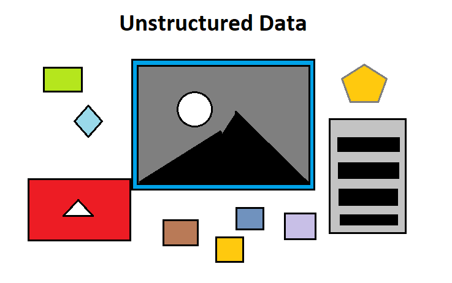
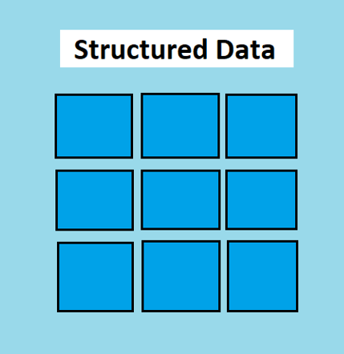
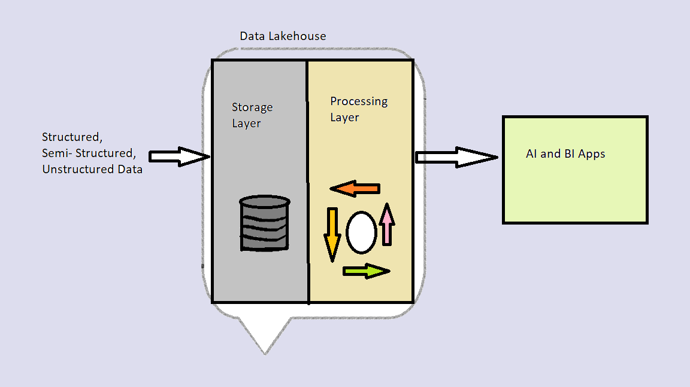

## **Assignment 2**
## **Name**: Akshitha Kukudala

## SQL, NoSQL data models

  

Structured data is the dream of every data scientist. It is neat and clean. It has a defined schema and can fit into the fixed fields in a table. Easy to maintain and the performance is high. But today’s world is producing increasingly diverse data challenging relational databases and giving opportunity to NoSQL data models as below.

* Key-value databases, in which data is stored in key/value pairs and the values can be integer, string or complex datatypes such as sets of data.
* Columnar databases, stored in record order, meaning that the first entry in one column is related to the first entry in other columns.
* Document-oriented databases store data in the form of key/value which has a unique identifier and the value itself serves as the document.
* Graph databases organizes data in a form of graph. It contains a collection of nodes (entity) and edges (relationship between two entities).

## Data Lake

* Data Lake has an ability to ingest raw bigdata in a variety of formats (structured, unstructured, semi-structured). That makes a data lake the clear choice for data storage.  
But, Wait!
* It can get messy if people dump all the data. It might have technical complexities, privacy and performance issues.
* A hybrid approach which combines the best qualities of the data lake and data warehouse forms Data lakehouse. With the data lakehouse, it’s no longer necessary to maintain multiple systems simultaneously which is time consuming and costly. They can all be in one location.

## Articles Referenced:
* [NoSQL Data Models](https://www.digitalocean.com/community/tutorials/a-comparison-of-nosql-database-management-systems-and-models)
* [Data Lake](https://databricks.com/glossary/data-lake)

